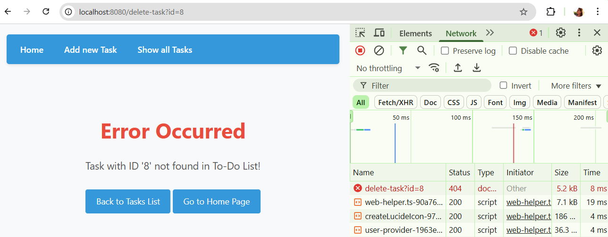

# To-Do List Web Application

## Project Overview
Create a simple Web Application for managing a To-Do List using Servlet API, JSP, HTML, and CSS.

## Functional Requirements
The Web Application must provide the following functionality:

1. Create a new Task with a specified Priority
2. View information about a Task in the To-Do List
3. Edit a Task in the To-Do List
4. Delete a Task from the To-Do List
5. Display all Tasks in the To-Do List

All operations must be accessible through a Web Interface.

## Application Routes and Pages

### 1. Home Page
**Route:** `http://<host-name:port>/home`

  
  
<em>Figure 1: Home page with navigation links to other pages</em>

A landing page with navigation links to all other pages of the application.

### 2. Create Task Page
**Route:** `http://<host-name:port>/create-task`

  
  
<em>Figure 2: Create Task page with form for adding new tasks</em>

This page allows users to create a new task and save it to the To-Do List.

**Notes:**
- Priority is an enum with values 'Low', 'Medium', and 'High'
- If a task with the given name already exists in the To-Do List, redirect to the same page and display an error message

  
  
<em>Figure 3: Error message when attempting to create a task with a duplicate name</em>

### 3. Tasks List Page
**Route:** `http://<host-name:port>/tasks-list`

  
  
<em>Figure 4: Tasks List page showing all tasks in a table with action buttons</em>

This page displays all tasks from the To-Do List organized in a table, with buttons for viewing, editing, and deleting tasks.

### 4. Read Task Page
**Route:** `http://<host-name:port>/read-task?id=<task ID>`

  
  
<em>Figure 5: Read Task page showing detailed information about a specific task</em>

This page displays detailed information about the task that corresponds to the ID specified in the request parameters.

**Error Handling:**
- If the task with the given ID is not found in the To-Do List, redirect to the error page and return status code 404

  
  
<em>Figure 6: Error page displayed when a task with the specified ID is not found</em>

### 5. Edit Task Page
**Route:** `http://<host-name:port>/edit-task?id=<task ID>`

  
  
<em>Figure 7: Edit Task page with form for modifying an existing task</em>

This page allows users to edit an existing task that corresponds to the ID specified in the request parameters.

**Error Handling:**
- If the task with the given ID is not found in the To-Do List, redirect to the error page and return status code 404

  
  
<em>Figure 8: Error page displayed when attempting to edit a non-existent task</em>

### 6. Delete Task Functionality
**Route:** `http://<host-name:port>/delete-task?id=<task ID>`

  
  
<em>Figure 9: Confirmation dialog when deleting a task</em>

The 'Delete' button removes the task that corresponds to the ID specified in the request parameters from both the To-Do List and the displayed table.

  
  
<em>Figure 10: Error page displayed when deleting a task</em>

## Technical Requirements

- JavaScript and JavaScript libraries like jQuery are not allowed
- All pages must contain valid HTML and CSS code

## Submission Requirements

Record a short video (5-10 minutes) demonstrating the functionality of your Web Application and publish it on your YouTube channel.

## Useful Links

### Java & Jakarta EE
- [Jakarta Servlet Specification](https://jakarta.ee/specifications/servlet/) - Official documentation for Jakarta Servlet API
- [Java EE Tutorial](https://docs.oracle.com/javaee/7/tutorial/servlets.htm) - Oracle's tutorial on Servlet technology
- [Jakarta EE Tutorial](https://eclipse-ee4j.github.io/jakartaee-tutorial/) - Comprehensive guide to Jakarta EE

### JSP (JavaServer Pages)
- [JSP Documentation](https://docs.oracle.com/javaee/5/tutorial/doc/bnagx.html) - Oracle's guide to JavaServer Pages
- [JSTL Documentation](https://docs.oracle.com/javaee/5/tutorial/doc/bnakc.html) - JSP Standard Tag Library reference

### Web Development
- [HTML MDN Web Docs](https://developer.mozilla.org/en-US/docs/Web/HTML) - Comprehensive HTML resources and tutorials
- [CSS MDN Web Docs](https://developer.mozilla.org/en-US/docs/Web/CSS) - Complete CSS reference and guides
- [W3Schools HTML Tutorial](https://www.w3schools.com/html/) - Interactive HTML learning resource
- [W3Schools CSS Tutorial](https://www.w3schools.com/css/) - Step-by-step CSS tutorials

### Application Servers
- [Apache Tomcat](https://tomcat.apache.org/) - Servlet container used in the application
- [Tomcat Documentation](https://tomcat.apache.org/tomcat-10.0-doc/index.html) - Official Apache Tomcat documentation

### Design Patterns
- [MVC Pattern](https://www.tutorialspoint.com/design_pattern/mvc_pattern.htm) - Model-View-Controller architecture explanation
- [Java Design Patterns](https://www.javatpoint.com/design-patterns-in-java) - Common design patterns used in Java applications
